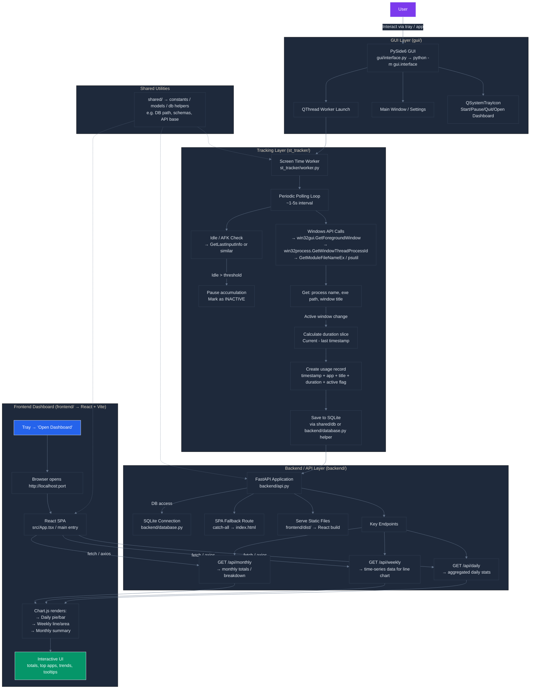

<h1>
  
  WinTrack 
</h1>
  
A Windows desktop screen-time tracking application built using:

- PySide6 (Desktop application & system tray integration)
- FastAPI (Local backend API)
- SQLite (Persistent data storage)
- React + Vite (Interactive dashboard frontend)
- Chart.js (Data visualization and analytics)
- PyInstaller (Executable `(.exe)` packaging)
- Inno Setup (Windows installer creation)

The application monitors active window usage and provides:
- Detailed daily usage statistics
- Weekly usage trends and analytics
- Monthly summaries and aggregated insights

[Discord](https://discord.gg/UGsYzs8DMK)

---

# Table of Contents

- [Features](#features)
- [Screenshots](#screenshots)
- [Architecture](#architecture)
- [Project Structure](#project-structure)
- [Local Development](#local-development)
- [Building Production App](#building-production-app)
- [Versioning System](#versioning-system)
- [Release Flow](#release-flow)

---

## Features
- Real-time application usage tracking
- Automatic detection of inactive/idle time with smart handling
- Customizable inactive time threshold
- Daily usage breakdown
- Weekly usage trends (interactive line charts)
- Monthly productivity summaries
- In-app update notifications
- System tray integration for background operation
---

## Screenshots


---

## Architecture


---

## Project Structure
```
WinTrack/
│
├── backend/                #FastAPI backend
├── frontend/               #React + Vite dashboard
├── gui/                    #PySide6 system tray app
├── shared/                 #Shared utilities (paths, memory, status)
├── version.json            #Local app version
├── remote_version.json     #Remote version checker
```

---

## Local Development

### 1. Clone
```
git clone https://github.com/sr1k7nth/WinTrack.git
cd WinTrack
```

### 2. Backend Setup
```
python -m venv venv
venv\Scripts\activate
pip install -r requirements.txt
```

### 3. Frontend Setup
```
cd frontend
npm install
npm run dev
```

Dashboard runs at:
`http://localhost:7070`
Backend runs at:
`http://127.0.0.1:7777`

- - -

## Building Production App

### Building the Executable
```
pyinstaller --onedir ^
--icon=media/logo.ico ^
--add-data "media;media" ^
--add-data "frontend/dist;frontend/dist" ^
--add-data "version.json;." ^
--name WinTrack ^
--paths=. ^
gui/interface.py
```

## Creating Installer

1. Open WinTrack.iss
2. Update:
   `#define MyAppVersion "x.x.x"`
3. Compile in Inno Setup

⚠️ **Do NOT change AppId between versions.**

---

## Versioning System

WinTrack uses a lightweight remote version-check mechanism.

- `version.json` → Current installed application version
- `remote_version.json` → Latest available release version (hosted on GitHub)

On startup, the app requests:
`https://raw.githubusercontent.com/sr1k7nth/WinTrack/main/remote_version.json`

If:
`latest_version > current_version`
An update notification banner is displayed inside the dashboard.

---

## Release Flow

1. Update version.json
2. Clean build (delete dist/ build/)
3. Rebuild executable
4. Update Inno Setup version
5. Compile installer
6. Upload installer to GitHub Releases
7. Update remote_version.json